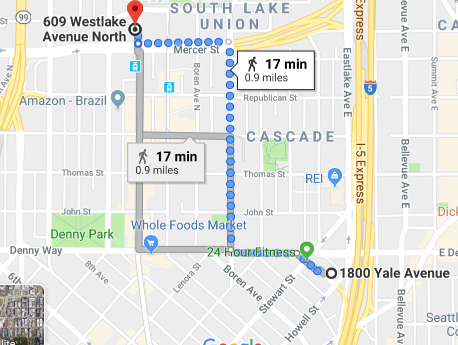

## Lodging and Retreat Location
SpringHill Suites Downtown
1800 Yale Ave.
Seattle, WA 98101

## Wednesday Social
Flatstick Pub, South Lake Union 7-9 p.m.
609 Westlake Ave. N
Seattle, WA 98109

For those who want to stretch their legs after an amazing day of sessions, here is a walking map. 

	

		
	

Uber pool is a great way to make friends with other participants and get to the social in style.

## Thursday Banquet Dinner

SpringHill Suites Downtown
1800 Yale Ave.
Seattle, WA 98101

Join us back at the retreat location for Thursday’s banquet. This will be an event to remember featuring a Seattle renowned chef designing our menu. 

## Transportation

Main Airport: (SEATAC)

### Getting to the Retreat

### Directions

<a href="https://www.google.com/maps/dir/Seattle-Tacoma+International+Airport+(SEA),+17801+International+Blvd,+Seattle,+WA+98158/SpringHill+Suites+by+Marriott+Seattle+Downtown%2FSouth+Lake+Union,+1800+Yale+Ave,+Seattle,+WA+98101/data=!4m8!4m7!1m2!1m1!1s0x5490435542eafefd:0x99d3d9c4c7dc37b7!1m2!1m1!1s0x549015345b238c41:0x6d4697f1f8a61ffb!3e0?sa=X&ved=2ahUKEwiak9bm_u_jAhVqi1QKHYiWDZMQ-A8wAHoECAoQDQ" target="_blank" rel="noopener noreferrer">From Seattle-Tacoma International Airport via CAR or BUS</a>

[Directions using the LINK LIGHT RAIL](https://www.soundtransit.org/tripplanner/to/location:2590c3d019d4d1666a371bcf92e45ee8/from/location:fbf29a6a1c5c9d2c7d9c640e2af19d4b/after/1565155667649/travel-by/bus,train/route-option/fastest%20trip/max-walk/1609) - All the directions you need can be found here.
The Link takes about an hour from the airport to the hotel. You will arrive about a half mile from the hotel. The light rail comes every 15 minutes. 

[From 1-5 North](https://www.google.com/maps/dir/Bellingham,+Washington/SpringHill+Suites+by+Marriott+Seattle+Downtown%2FSouth+Lake+Union,+1800+Yale+Ave,+Seattle,+WA+98101/@48.1794095,-123.4481163,8z/data=!3m1!4b1!4m14!4m13!1m5!1m1!1s0x5485962ef2458717:0xd57a9ca9cd39e0f0!2m2!1d-122.4786854!2d48.7519112!1m5!1m1!1s0x549015345b238c41:0x6d4697f1f8a61ffb!2m2!1d-122.329817!2d47.617814!3e0)

[From 1-5 South](https://www.google.com/maps/dir/Portland,+Oregon/SpringHill+Suites+by+Marriott+Seattle+Downtown%2FSouth+Lake+Union,+1800+Yale+Ave,+Seattle,+WA+98101/@46.5563098,-123.7221807,8z/data=!3m1!4b1!4m14!4m13!1m5!1m1!1s0x54950b0b7da97427:0x1c36b9e6f6d18591!2m2!1d-122.6750261!2d45.5051064!1m5!1m1!1s0x549015345b238c41:0x6d4697f1f8a61ffb!2m2!1d-122.329817!2d47.617814!3e0)

## Parking

Parking at the hotel is $30 a day. Seattle has some parking meters and free parking close to the hotel. Finding free parking can be tricky.  There are also parking garages close to the venue. [Click here](https://www.parkingpanda.com/springhill-suites-seattle-downtown-south-lake-union-seattle-parking) for a full map of garages and pricing. To find discounts on parking or the lowest rates in the area, also consider using [SpotHero.com](http://SpotHero.com). 

## Getting Around Seattle
Seattle has some of the best public transportation in the United States. You can purchase daily passes for unlimited use at multiple [locations](https://kingcounty.gov/depts/transportation/metro/fares-orca/where-to-buy.aspx) throughout Seattle and at the SEATAC airport.  Visit [King County Metro](https://kingcounty.gov/depts/transportation/metro.aspx) to learn more about how to use and plan a trip or download the app One Bus Away for live route information. 

### Ride Share

Uber and Lyft are easily accessible throughout the city but can become expensive during commuting hours in the morning and evening. During rush hours, public transportation is the best option as there are dedicated bus lanes and the light rail is underground in the city.

###How do we get to the Emergent Leader Retreat?

[For directions click here](https://mvaelr.netlify.com/travel/#directions)

### Where will I be staying and with whom?

If you are staying in MVA sponsored lodging, you will be staying in a room at SpringHill suites. You will receive an email with instructions for checking in and other travel related items in advance of the retreat start day. 

### What should I do if I have dietary needs/restrictions?

If you have not already submitted your dietary restrictions please email [jballentine@minorityvets.org](jballentine@minorityvets.org)

### Who do I contact if I have additional questions or concerns?

[Jade Ballentine](jballentine@minorityvets.org) is the executive administrator for MVA. Please reach out to her with any questions. 

[425-802-4976](tel:425-802-4976)